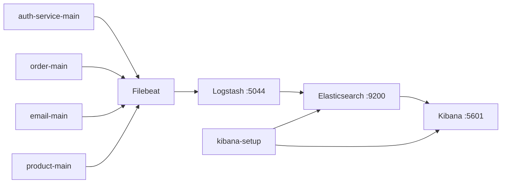

# Monitoring ELK untuk Microservices

Dokumen ini menjelaskan cara membuat, menjalankan, dan mengintegrasikan stack monitoring berbasis ELK untuk empat container aplikasi berikut:

- `auth-service-main`
- `order-main`
- `email-main`
- `product-main`

Stack ini memakai:

- Elasticsearch sebagai penyimpanan log
- Logstash sebagai pipeline parsing dan indexing
- Kibana sebagai visualisasi dan analisis log
- Filebeat sebagai collector log Docker container

## 1. Tujuan

Tujuan proyek ini adalah mengumpulkan log dari beberapa microservice Docker ke satu tempat, memisahkan index per service, lalu menampilkannya di Kibana agar pencarian log, troubleshooting, dan monitoring lebih mudah.

## 2. Arsitektur



Alur datanya seperti ini:

1. Filebeat membaca file log Docker dari container target.
2. Filebeat mengirim event ke Logstash melalui Beats input pada port `5044`.
3. Logstash melakukan tagging service, parsing log, lalu mengirim ke Elasticsearch.
4. Kibana membaca index di Elasticsearch.
5. `kibana-setup` membuat data view dan default index di Kibana.

## 3. Struktur Project

```text
docker-compose.yml
.env
elasticsearch/
  elasticsearch.yml
filebeat/
  filebeat.yml
kibana/
  kibana.yml
kibana-setup/
  setup.sh
logstash/
  logstash.yml
  pipeline/
    logstash.conf
```

## 4. Prasyarat

Sebelum menjalankan stack ini, siapkan hal berikut:

1. Docker Desktop atau Docker Engine aktif.
2. Docker Compose v2 tersedia melalui perintah `docker compose`.
3. Port berikut tidak sedang dipakai:
   - `9200` untuk Elasticsearch
   - `9300` untuk internal Elasticsearch transport
   - `5601` untuk Kibana
   - `5044` untuk Beats input ke Logstash
   - `5000` TCP/UDP bila ingin menerima log tambahan via Logstash
   - `9600` untuk API monitoring Logstash
4. Empat aplikasi target berjalan sebagai Docker container dengan nama:
   - `auth-service-main`
   - `order-main`
   - `email-main`
   - `product-main`

## 5. Konfigurasi Environment

File [.env](.env) mengatur versi image dan alamat internal service:

```env
ELASTIC_VERSION=8.11.0
ELASTICSEARCH_HOST=elasticsearch
ELASTICSEARCH_PORT=9200
KIBANA_HOST=kibana
KIBANA_PORT=5601
LOGSTASH_HOST=logstash
LOGSTASH_PORT=5044
ES_JAVA_OPTS=-Xms512m -Xmx512m
LS_JAVA_OPTS=-Xms256m -Xmx256m
```

Jika resource mesin kecil, nilai heap Java bisa diturunkan. Jika log sangat besar, nilai heap bisa dinaikkan dengan tetap memperhatikan RAM host.

## 6. Langkah Pembuatan Stack

### 6.1. Buat Docker Compose

File [docker-compose.yml](docker-compose.yml) mendefinisikan lima service utama:

1. `elasticsearch`
2. `logstash`
3. `kibana`
4. `filebeat`
5. `kibana-setup`

Relasi penting:

1. `logstash` menunggu `elasticsearch` sehat.
2. `kibana` menunggu `elasticsearch` sehat.
3. `filebeat` menunggu `elasticsearch` sehat dan `logstash` berjalan.
4. `kibana-setup` menunggu `kibana` sehat.

### 6.2. Konfigurasi Elasticsearch

File [elasticsearch/elasticsearch.yml](elasticsearch/elasticsearch.yml) dipakai untuk mode single-node dan monitoring lokal.

Konfigurasi penting:

1. `discovery.type: single-node`
2. `xpack.security.enabled: false`
3. `path.logs: /usr/share/elasticsearch/logs`

Catatan:

Path log harus menunjuk ke direktori yang writable di image Elasticsearch. Path `/var/log/elasticsearch` menyebabkan container gagal boot pada image yang dipakai di repo ini.

### 6.3. Konfigurasi Logstash

File [logstash/logstash.yml](logstash/logstash.yml) mengatur port API dan runtime dasar Logstash.

Pipeline utama ada di [logstash/pipeline/logstash.conf](logstash/pipeline/logstash.conf).

Fungsi pipeline:

1. menerima data Beats di port `5044`
2. mendeteksi nama service dari metadata container
3. parsing log JSON Spring Boot bila payload berbentuk JSON
4. parsing plain text log bila payload non-JSON
5. memberi severity berdasarkan `log_level`
6. membuat index harian per service dengan format:

```text
microservices-<service_name>-YYYY.MM.dd
```

Contoh hasil:

```text
microservices-auth-service-main-2026.07.11
microservices-order-main-2026.07.11
microservices-email-main-2026.07.11
microservices-product-main-2026.07.11
```

### 6.4. Konfigurasi Filebeat

File [filebeat/filebeat.yml](filebeat/filebeat.yml) memakai `autodiscover` berbasis Docker.

Log hanya diambil dari container yang namanya mengandung salah satu nilai berikut:

1. `auth-service-main`
2. `order-main`
3. `email-main`
4. `product-main`

Filebeat membaca log Docker dari:

```text
/var/lib/docker/containers/<container_id>/*.log
```

Lalu Filebeat mengirim event ke Logstash pada host `logstash:5044`.

### 6.5. Konfigurasi Kibana

File [kibana/kibana.yml](kibana/kibana.yml) menghubungkan Kibana ke Elasticsearch internal.

Konfigurasi aktif yang penting:

1. `server.host: 0.0.0.0`
2. `elasticsearch.hosts: ["http://elasticsearch:9200"]`
3. `telemetry.enabled: false`

Catatan kompatibilitas:

Beberapa key lama seperti `monitoring.enabled` dan `kibana.index` tidak valid pada Kibana `8.11.x` dan harus dihapus.

### 6.6. Setup Otomatis Kibana

File [kibana-setup/setup.sh](kibana-setup/setup.sh) menjalankan bootstrap berikut:

1. menunggu Kibana sehat
2. membuat data view untuk tiap service
3. membuat data view gabungan `microservices-*`
4. menjadikan `microservices-all` sebagai default index
5. membuat ILM policy `microservices-logs-policy`

## 7. Langkah Menjalankan Stack

Jalankan semua perintah dari root project:

```powershell
cd D:\microservices\monitoring-elk
docker compose up -d
```

Lalu verifikasi status service:

```powershell
docker compose ps -a
```

Status minimal yang diharapkan:

1. `elasticsearch` = `healthy`
2. `kibana` = `healthy`
3. `logstash` = `Up`
4. `filebeat` = `Up`
5. `kibana-setup` = `Exited (0)`

## 8. Langkah Integrasi Microservice

Bagian ini menjelaskan bagaimana sebuah aplikasi masuk ke pipeline monitoring ini.

### 8.1. Jalankan aplikasi sebagai Docker container

Pastikan aplikasi benar-benar berjalan sebagai container Docker, bukan proses lokal biasa.

### 8.2. Gunakan nama container yang dikenali

Saat ini, integrasi aktif hanya untuk empat container berikut:

1. `auth-service-main`
2. `order-main`
3. `email-main`
4. `product-main`

Jika nama container berbeda, Filebeat tidak akan mengambil lognya.

### 8.3. Pastikan aplikasi menulis log ke stdout/stderr

Stack ini membaca log container Docker. Artinya:

1. aplikasi harus menulis log ke console
2. jangan hanya menulis ke file internal container bila file itu tidak dikirim ke stdout

### 8.4. Format log yang didukung

Pipeline saat ini mendukung dua pola:

1. log JSON, misalnya Spring Boot JSON logging
2. log plain text, misalnya log standar Spring Boot

Jika format log berbeda jauh, parsing di Logstash mungkin perlu diubah.

### 8.5. Menambahkan service baru

Jika Anda ingin memonitor service lain, lakukan tiga perubahan:

1. tambah kondisi container di [filebeat/filebeat.yml](filebeat/filebeat.yml)
2. tambah mapping `service_name` di [logstash/pipeline/logstash.conf](logstash/pipeline/logstash.conf)
3. tambah service baru ke daftar `SERVICES` di [kibana-setup/setup.sh](kibana-setup/setup.sh)

Setelah itu restart service ELK yang relevan:

```powershell
docker compose up -d --force-recreate filebeat logstash kibana-setup
```

## 9. Langkah Verifikasi Integrasi

### 9.1. Cek container aplikasi berjalan

```powershell
docker ps --format "table {{.Names}}`t{{.Status}}"
```

### 9.2. Cek index di Elasticsearch

```powershell
curl.exe -s http://localhost:9200/_cat/indices/microservices-*?v
```

Jika integrasi berhasil, akan muncul index per service.

### 9.3. Cek Elasticsearch dari browser atau curl

```powershell
curl.exe http://localhost:9200
```

### 9.4. Cek Kibana

Buka:

```text
http://localhost:5601
```

Lalu masuk ke:

1. `Discover`
2. pilih data view `microservices-*` atau per-service

## 10. Manual Operasional Harian

### Menyalakan stack

```powershell
docker compose up -d
```

### Mematikan stack

```powershell
docker compose down
```

### Melihat status service

```powershell
docker compose ps -a
```

### Melihat log Filebeat

```powershell
docker compose logs filebeat --tail 100
```

### Melihat log Logstash

```powershell
docker compose logs logstash --tail 100
```

### Melihat log Kibana

```powershell
docker compose logs kibana --tail 100
```

### Melihat log Elasticsearch

```powershell
docker compose logs elasticsearch --tail 100
```

## 11. Troubleshooting

### Masalah: data service tidak muncul di Kibana

Periksa urutan berikut:

1. container aplikasi benar-benar berjalan
2. nama container sama dengan daftar yang diawasi Filebeat
3. `logstash` dalam status `Up`
4. `filebeat` tidak gagal konek ke `logstash:5044`
5. index `microservices-*` muncul di Elasticsearch

### Masalah: Logstash crash saat start

Penyebab yang pernah terjadi di repo ini:

1. ada key config usang di [logstash/logstash.yml](logstash/logstash.yml)

Gejala:

```text
Setting "xpack.monitoring.elasticsearch.collection.enabled" doesn't exist
```

Solusi:

1. hapus key usang tersebut
2. restart Logstash

### Masalah: Elasticsearch gagal start

Penyebab yang pernah terjadi di repo ini:

1. `path.logs` mengarah ke lokasi yang tidak writable di container

Solusi:

1. gunakan `path.logs: /usr/share/elasticsearch/logs`

### Masalah: Kibana unhealthy atau restart loop

Penyebab yang pernah terjadi di repo ini:

1. ada key lama seperti `monitoring.enabled`
2. ada key lama seperti `kibana.index`

Solusi:

1. hapus key tersebut dari [kibana/kibana.yml](kibana/kibana.yml)
2. restart Kibana

### Masalah: Filebeat menampilkan warning deprecated

Warning berikut masih bisa muncul:

```text
DEPRECATED: Log input. Use Filestream input instead.
```

Ini tidak memblokir ingest, tetapi konfigurasi bisa dimigrasikan ke `filestream` di iterasi berikutnya.

## 12. Ringkasan Integrasi Cepat

Jika hanya ingin langkah cepat:

1. nyalakan empat container aplikasi target
2. jalankan `docker compose up -d`
3. cek `docker compose ps -a`
4. cek `curl.exe -s http://localhost:9200/_cat/indices/microservices-*?v`
5. buka `http://localhost:5601`
6. pilih data view `microservices-*`

## 13. File Konfigurasi Penting

- [docker-compose.yml](docker-compose.yml)
- [elasticsearch/elasticsearch.yml](elasticsearch/elasticsearch.yml)
- [logstash/logstash.yml](logstash/logstash.yml)
- [logstash/pipeline/logstash.conf](logstash/pipeline/logstash.conf)
- [filebeat/filebeat.yml](filebeat/filebeat.yml)
- [kibana/kibana.yml](kibana/kibana.yml)
- [kibana-setup/setup.sh](kibana-setup/setup.sh)